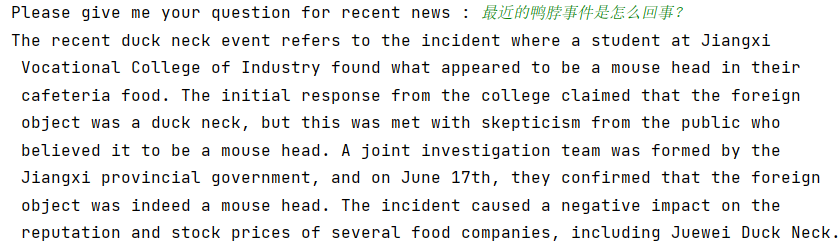
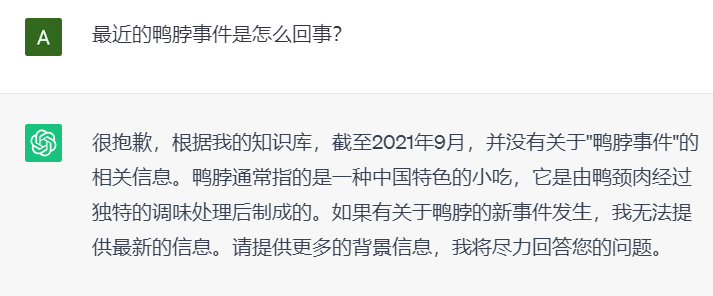

# NewsGPT
We know that ChatGPT has the data being trained in 2021, so ChatGPT cannot get the point of the news after 2021. So, we use News API to get the data around now and feed to ChatGPT, then ChatGPT can make comments on news happened recently.

### Config

Python: 3.8.13, pytorch: 1.12.1

### Run

~~~shell
python3 main.py
~~~

Info: You should get an openai APIKEY, a news APIKEY, and Hanlp APIKEY(optional) first and fill them to the '***' part in the code.

### Example

#### Compare to the normal ChatGPT

#### Conclusion

Because we use the recent news to 'train' ChatGPT, so ChatGPT knows better about recent news.
